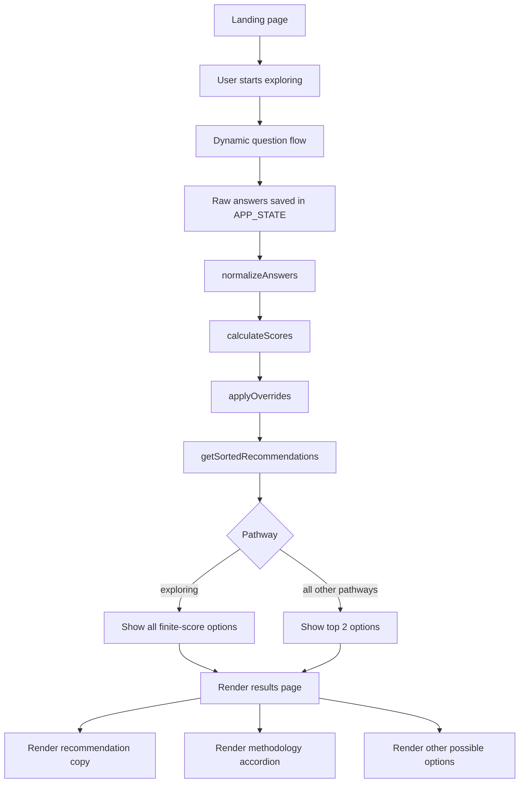

# Explore Micromobility Technical Workflow

Explore Micromobility was developed as a lightweight, scalable web app by the Lab @ MassDOT in Spring 2026, per the recommendations made by the Special Commission on Micromobility Report, which was filed with the Legislature in January 2026. The app is written in JavaScript, HTML, and CSS. The purpose of this document is to act as the source of truth for Explore Micromobility's technical components and to facilitate knowledge transfer and future maintenance. It explains what the app is trying to do, how the workflow and scoring work, which conventions should remain stable, and which risks or future changes are most important to understand before making updates. Explore Micromobility has gone through multiple rounds of rigorous testing with internal MassDOT and MBTA stakeholders across various department and reflects commonly-requested features, behaviors, and a high standard of polish and functionality. Further, the tool was audited and refined with MassDOT's Digital Services and Accessibility unit to ensure it meets or exceeds all WCAG 2.2 standards and MassDOT's Design System Guidelines. Documentation prepared by Oussama Ouadani, Lab Innovation Fellow. Code and documentation last updated on May 12, 2026. 

## 1. Goal of the App

### 1.1 Primary goal

Explore Micromobility helps a user explore micromobility options in a lightweight, public-facing way. It is not meant to make a legal, safety, financial, medical, or purchasing decision for the user.

### 1.2 Why the app exists

The app translates existing and recommended Massachusetts policy and law into a short guided experience that is easier for the public to use than reading a report or legal text directly.

### 1.3 What the app is designed to do

- ask a small number of questions
- explain results in plain language
- avoid endorsing a specific product
- remain easy to maintain without a backend
- stay accessible to keyboard and screen reader users

## 2. What This App Is

Explore Micromobility is a static front-end app. There is no backend, database, build step, or API.

Main files:

- [index.html](/Users/oo/Desktop/explore-micromobility/index.html): page shell, landing page markup, live regions, main containers
- [styles.css](/Users/oo/Desktop/explore-micromobility/styles.css): all visual styling, layout, and accessibility-focused visual states
- [script.js](/Users/oo/Desktop/explore-micromobility/script.js): app state, question flow, scoring, results rendering, disclosures, accessibility behavior
- [translations.js](/Users/oo/Desktop/explore-micromobility/translations.js): Spanish UI strings and localized device content overrides

The entire runtime is driven by `script.js`.

## 3. How the App Achieves Its Goal

The app achieves its goal by combining:

- a guided question flow
- a simple additive score model
- a small number of hard visibility and ranking rules
- plain-language recommendation language 
- a results explanation accordion

This keeps the app fast, transparent, and easy to host.

## 4. Workflow Diagram

## 5. User Workflow

The user flow is:

1. Landing page loads.
2. User chooses a language if needed.
3. User selects `Start exploring`.
4. Question 1 acts as four distinct pathways/branches, with each pathway slightly different to use specific langage and override certain results. 
5. The app shows one question at a time, with a maximum of 9 total question, and selects an answers and then uses the next button to navigate.
6. The app saves answers locally in memory only.
7. When the last question is submitted, the app normalizes the answers, calculates scores, sorts device options, and renders results.
8. The results page shows:
   - the top two recommendations
   - explanation copy for the current recommendation
   - an accordion that explains the scoring workflow (methodology of the app)
   - an accordion that shows other possible micromobility options
   - go back, print, and `Start over` actions, the latter of which brings the user back to the landing page

## 6. Runtime State

Current app state is stored in `APP_STATE` in [script.js](/Users/oo/Desktop/explore-micromobility/script.js:1204).

Main fields:

- `hasStarted`: whether the user has moved past landing
- `currentStep`: current question index within the active question sequence
- `answers`: raw answers keyed by question id
- `locale`: `en` or `es`
- `currentResultIndex`: current recommendation card in the results carousel
- `allResultsPanelOpen`: whether the “other possible options” disclosure accordion is open
- `resultsMethodologyOpen`: whether the methodology disclosure accordion is open
- `currentRecommendations`: currently rendered top recommendations
- `currentAllRecommendations`: sorted additional recommendation list
- `currentNormalizedAnswers`: normalized scoring answers
- `currentScores`: final device scores after overrides
- `currentPathway`: active pathway used for the current results

The app does not persist state across page reloads. Some users have noted that using their browser's back button retains their answers, though I was not able to replicate this. This behavior should be alleviated by the recent addition of a back button. 

## 7. Question Workflow

Question metadata lives in `QUESTIONS` in [script.js](/Users/oo/Desktop/explore-micromobility/script.js:1105).

Question ids:

- `pathway`
- `ageInput`
- `adaptiveNeed`
- `primaryUse`
- `transitLink`
- `carryChildren`
- `distance`
- `routeType`
- `storage`

The active question sequence is not static, it is built dynamically by `getVisibleQuestionKeys()` in [script.js](/Users/oo/Desktop/explore-micromobility/script.js:4191).

Current branching rules:

- `exploring` pathway:
  - shows only `pathway`
  - goes straight to results
- all other pathways:
  - always show `pathway`, `ageInput`, `adaptiveNeed`, `primaryUse`, `distance`, `routeType`, `storage`
  - show `transitLink` only when `primaryUse === "transport"`
  - show `carryChildren` for `myself` and `someoneElse`
  - do not show `carryChildren` for `child`

 Question total:

- `myself` / `someoneElse`:
  - 8 questions default
  - 9 if `primaryUse = transport`
- `child`:
  - 7 questions default 
  - 8 if `primaryUse = transport`
- `exploring`:
  - 1 question only, immediately shows results

Current combination count:

- The app currently allows `167,185` unique completed answer combinations.
- This count reflects the live branching logic as of May 12, 2026, including:
  - exact ages from `3` to `100`
  - the `exploring` path as a single-step direct-to-results flow
  - `transitLink` appearing only when `primaryUse = transport`
  - the `child` pathway still including `carryChildren`
  - the `child` pathway hiding `deliveries` unless the entered age is `18` or older

Pathway-specific wording is handled by `getQuestionLabelForPathway()` in [script.js](/Users/oo/Desktop/explore-micromobility/script.js:1782).

Special question behavior:

- `ageInput` uses a text input with numeric input mode.
- In the `child` pathway, `primaryUse = deliveries` is hidden unless the entered age is 18 or older. This logic is in `getRenderedQuestionOptions()` in [script.js](/Users/oo/Desktop/explore-micromobility/script.js:3678) and derives from the Special Commission on Micromobility's Report.

## 8. Navigation Workflow

Main UI render functions:

- `renderLandingScreen()` in [script.js](/Users/oo/Desktop/explore-micromobility/script.js:3808)
- `renderQuestion()` in [script.js](/Users/oo/Desktop/explore-micromobility/script.js:3850)
- `submitCurrentAnswers()` in [script.js](/Users/oo/Desktop/explore-micromobility/script.js:3652)
- `renderRecommendations()` in [script.js](/Users/oo/Desktop/explore-micromobility/script.js:3325)
- `renderCurrentRecommendationPage()` in [script.js](/Users/oo/Desktop/explore-micromobility/script.js:3369)

Button handlers:

- `handleNext()` in [script.js](/Users/oo/Desktop/explore-micromobility/script.js:4107)
- `handleBack()` in [script.js](/Users/oo/Desktop/explore-micromobility/script.js:4129)

Results actions:

- `Go back` returns the user to questions without clearing answers
- `Start over` clears state and returns to landing
- `Print results` calls `window.print()`

## 9. Scoring Workflow

### 9.1 Outputs

The app currently scores 8 outputs, defined in `OUTPUTS` in [script.js](/Users/oo/Desktop/explore-micromobility/script.js:1):

- `bicycle`
- `ebike`
- `escooter`
- `lowSpeedPoweredMicromobility`
- `cargoBike`
- `bikeshare`
- `adaptiveMobility`
- `humanPoweredYouth`

### 9.2 Score pipeline

The scoring process is as follows:

1. Raw answers are normalized by `normalizeAnswers()` in [script.js](/Users/oo/Desktop/explore-micromobility/script.js:1684).
2. `ageInput` is converted into an age bracket:
   - `age3to13`
   - `age14to16`
   - `age17to49`
   - `age50plus`
3. `calculateScores()` in [script.js](/Users/oo/Desktop/explore-micromobility/script.js:1719) starts all devices at `0`.
4. For each normalized answer, the app looks up the matching rule block in `SCORING_RULES`.
5. Nonzero points are added to device totals.
6. `applyOverrides()` in [script.js](/Users/oo/Desktop/explore-micromobility/script.js:1547) applies hard visibility rules after the additive points are tallied. These are based on existing Massachusetts law or recommended future practices made by the Special Commission on Micromobility Report.
7. `getSortedRecommendations()` in [script.js](/Users/oo/Desktop/explore-micromobility/script.js:1684) sorts remaining finite scores high to low.
8. If two outputs have the same score, the tie is broken by the stable output order already defined in `OUTPUTS`.
9. Placement helpers then adjust rank for special cases:
   - `enforcePriorityPlacement()` in [script.js](/Users/oo/Desktop/explore-micromobility/script.js:1630)
   - `enforceCargoBikePlacement()` in [script.js](/Users/oo/Desktop/explore-micromobility/script.js:1614)

### 9.3 Point range

The scoring model is purposefully simple:

- most direct answer-based point changes are between `-3` and `+3`
- the strongest normal positive boost is `+3`
- the age 3 to 13 youth rule gives `humanPoweredYouth +10`
- hard overrides use:
  - `-Infinity` to hide an option

Priority placement is handled after scoring through explicit ranking helpers, which keeps the scoring scale consistent and easier to maintain.

### 9.4 Scoring parameters

The exact score map is defined in `SCORING_RULES` in [script.js](/Users/oo/Desktop/explore-micromobility/script.js:792). The list below shows only nonzero changes. Any omitted device gets `0` for that answer.

#### Age

- `age3to13`: `humanPoweredYouth +10`
- `age14to16`: `bicycle +2`, `ebike +1`
- `age50plus`: `ebike +1`, `adaptiveMobility +3`

#### Adaptive need

- `yes`: `bicycle +1`, `ebike +1`, `cargoBike +1`, `adaptiveMobility +3`

#### Primary use

- `transport`: `bicycle +1`, `ebike +2`, `escooter +2`, `lowSpeedPoweredMicromobility +1`, `cargoBike +1`, `bikeshare +2`
- `deliveries`: `bicycle +1`, `ebike +3`, `cargoBike +3`
- `recreation`: `bicycle +3`, `ebike +1`, `escooter +1`, `lowSpeedPoweredMicromobility +1`, `adaptiveMobility +2`, `bikeshare +1`

#### Transit connection

- `yes`: `bicycle +1`, `ebike +1`, `escooter +2`, `lowSpeedPoweredMicromobility +1`, `bikeshare +2`

#### Carrying children

- `yes`: `bicycle +1`, `ebike +1`, `cargoBike +3`, `adaptiveMobility +1`

#### Distance

- `under3`: `bicycle +2`, `escooter +2`, `lowSpeedPoweredMicromobility +2`, `cargoBike +1`, `adaptiveMobility +1`, `bikeshare +2`
- `3to9`: `bicycle +1`, `ebike +2`, `escooter +1`, `cargoBike +2`, `adaptiveMobility +1`, `bikeshare +1`
- `10plus`: `bicycle +1`, `ebike +2`, `cargoBike +2`, `adaptiveMobility +1`

#### Route type

- `bikeLanes`: `bicycle +1`, `ebike +1`, `escooter +1`, `lowSpeedPoweredMicromobility +1`, `cargoBike +1`, `adaptiveMobility +1`, `bikeshare +1`
- `mixedRoads`: `escooter -2`, `lowSpeedPoweredMicromobility -3`
- `regularRoads`: `ebike +1`, `lowSpeedPoweredMicromobility -3`, `cargoBike +2`
- `trails`: `bicycle +2`, `ebike +1`, `lowSpeedPoweredMicromobility +1`, `adaptiveMobility +1`

#### Storage

- `indoor`: `bicycle +1`, `ebike +1`, `escooter +1`, `lowSpeedPoweredMicromobility +2`, `adaptiveMobility -1`, `bikeshare +1`
- `outdoor`: `bicycle +2`, `ebike +1`, `escooter +1`, `bikeshare +2`

### 9.5 Hard overrides

After additive scoring, the app applies hard rules in `applyOverrides()`:

- `exploring` pathway:
  - no visibility overrides are applied
- `age3to13`:
  - hides all adult-oriented devices
  - keeps `humanPoweredYouth` visible
  - keeps `adaptiveMobility` visible only if `adaptiveNeed = yes`
- `age14to16`:
  - hides `escooter`, `lowSpeedPoweredMicromobility`, `bikeshare`
- `age50plus`:
  - hides `escooter`, `lowSpeedPoweredMicromobility`
- `carryChildren = yes`:
  - hides `escooter`, `lowSpeedPoweredMicromobility`
- `routeType = regularRoads` or `trails`:
  - hides `escooter`
- `routeType` not `bikeLanes` or `trails`:
  - hides `lowSpeedPoweredMicromobility`
- `distance` not `under3`:
  - hides `lowSpeedPoweredMicromobility`
- `storage` not `indoor`:
  - hides `lowSpeedPoweredMicromobility`
- `storage = indoor`:
  - subtracts `1` from `cargoBike`

### 9.6 Ranking rules after scoring

The app uses explicit ranking rules after sorting instead of heavy scoring changes:

- if `age3to13` and `adaptiveNeed = yes`, move `adaptiveMobility` to position 1 and `humanPoweredYouth` to position 2
- if `age3to13` and `adaptiveNeed != yes`, move `humanPoweredYouth` to position 1
- if `adaptiveNeed = yes` outside the youth path, move `adaptiveMobility` to position 1
- if `carryChildren = yes`, move `cargoBike` to at least position 2

These rules are ranking adjustments, and do not add new points. This separation keeps the additive scoring model stable and makes priority rules easier to inspect during maintenance or refinements.

### 9.7 Results selection

- standard pathways:
  - the results page shows the top 2 finite-score recommendations
- `exploring` pathway:
  - the results page shows all finite-score recommendations
- the `Other possible micromobility options` disclosure shows additional positive-score results after the top 2

## 10. Recommendation Content Workflow

Recommendation content is stored in `DEVICE_CONTENT` in [script.js](/Users/oo/Desktop/explore-micromobility/script.js:85).

Each device can define:

- `image`
- `cost`
- `whyBase`
- `whyConditional`
- `considerBase`
- `considerConditional`
- `nextSteps`

Localized device content can override the English defaults through `I18N.deviceContent` in [translations.js](/Users/oo/Desktop/explore-micromobility/translations.js).

Merge behavior lives in `getDeviceContent()` in [script.js](/Users/oo/Desktop/explore-micromobility/script.js:1015).

### 10.1 Why text assembly

The main rationale paragraph is assembled from two components:

- a `whyBase`
- matching conditional fragments based on selected answers

Helpers:

- `getWhyBase()` in [script.js](/Users/oo/Desktop/explore-micromobility/script.js:1044)
- `getWhyConditional()` in [script.js](/Users/oo/Desktop/explore-micromobility/script.js:1060)
- `WHY_CONDITIONAL_KEY_MAP` in [script.js](/Users/oo/Desktop/explore-micromobility/script.js:1048)

Conditional fragments are currently supported in content:

- age:
  - `age3to13`
  - `age14to16`
  - `age17to49`
  - `age50plus`
- mobility:
  - `adaptiveNeedYes`
  - `adaptiveNeedNo`
- use:
  - `transport`
  - `deliveries`
  - `recreation`
- transit:
  - `transitLinkYes`
  - `transitLinkNo`
- children:
  - `carryChildrenYes`
  - `carryChildrenNo`
- distance:
  - `distanceUnder3`
  - `distance3to9`
  - `distance10plus`
- route:
  - `routeBikeLanes`
  - `routeMixedRoads`
  - `routeRegularRoads`
  - `routeTrails`
- storage:
  - `storageIndoor`
  - `storageOutdoor`
  - `storageNotMajorConcern`

### 10.2 Guidance text assembly

The “What to know about this option” section uses:

- a `considerBase`
- matching `considerConditional` fragments based on selected answers

Helpers:

- `getConsiderBase()` in [script.js](/Users/oo/Desktop/explore-micromobility/script.js:1071)
- `getConsiderConditionalValue()` in [script.js](/Users/oo/Desktop/explore-micromobility/script.js:1088)
- `CONSIDER_CONDITIONAL_KEY_MAP` in [script.js](/Users/oo/Desktop/explore-micromobility/script.js:1075)

### 10.3 Explore-all copy

The `exploring` pathway does not use the normal recommendation explanation assembly. It uses `EXPLORE_REASON_TEXT` in [script.js](/Users/oo/Desktop/explore-micromobility/script.js:773), since no questions are being answered. Similarly, this pathway also skips the results methodology accordion.

## 11. Results Page Workflow

Results rendering starts in `renderRecommendations()` and then `renderCurrentRecommendationPage()`.

Current results page components:

- main recommendation card
- recommendation image and alt text
- “What to know about this option”
- “More resources for this option”
- `How Explore Micromobility shows options` accordion
- `Other possible micromobility options` accordion 
- results pager
- `Go back`, `Start over`, and `Print results` buttons
- footer disclaimer and feedback prompt

Supporting helpers:

- rationale text: `getRecommendationReason()`
- methodology accordion: `renderResultsMethodology()`
- additional devices accordion: `renderAllDeviceResultsPanel()`
- print summary: `renderPrintSummary()`

## 12. Localization Workflow

Current locale support:

- English defaults live mostly in `script.js`
- Spanish overrides live in `translations.js`

Localization touchpoints:

- UI labels: `window.MICROMOBILITY_TRANSLATIONS.ui.es`
- output labels: `window.MICROMOBILITY_TRANSLATIONS.outputs.es`
- device content overrides: `window.MICROMOBILITY_TRANSLATIONS.deviceContent.es`

**If English copy changes in `script.js`, Spanish needs a parallel, manual update in `translations.js`.**

## 13. Accessibility Workflow

Key accessibility behaviors implemented:

- landing page and questions pages (result states) are semantically separated for clear user orientation 
- question number is included in the accessible question label before the question text
- question errors are announced through a persistent live region for screen reader compatibility 
- route images use null alt text where the image is decorative
- results and accordions use button-based controls
- results page has a stable focus target and clearer reading order than earlier versions
- the final question action is a text button, not only an arrow

Main accessibility-related render logic lives in:

- `renderQuestion()`
- `showStepError()`
- `clearStepError()`
- `renderCurrentRecommendationPage()`

## 14. Naming, ID, Class, and Function Conventions

**The following section is important for consistency and app stability.** A new developer should be cautious not to invent a new naming system if an existing one already works and is sufficient for their purposes.

### 14.1 Data key conventions

These id keys should stay the same across the codebase:

- output ids:
  - `bicycle`
  - `ebike`
  - `escooter`
  - `lowSpeedPoweredMicromobility`
  - `cargoBike`
  - `bikeshare`
  - `adaptiveMobility`
  - `humanPoweredYouth`
- question ids:
  - `pathway`
  - `ageInput`
  - `adaptiveNeed`
  - `primaryUse`
  - `transitLink`
  - `carryChildren`
  - `distance`
  - `routeType`
  - `storage`

Important rule:

- if a new output id is added, it usually must also be added to:
  - `OUTPUTS`
  - `SCORING_RULES`
  - `DEVICE_CONTENT`
  - localized output labels
  - localized device content if needed
- output order inside `OUTPUTS` also acts as the stable tie-break order when two devices end with the same score

### 14.2 ID conventions

DOM ids are used for both scripting and accessibility. They should not be renamed casually as they have contingencies.

Examples:

- `progress`
- `formStep`
- `result`
- `backBtn`
- `nextBtn`
- `resultsHeading`
- `results-methodology-trigger`
- `results-methodology-panel`
- `stepError`
- `stepErrorLive`

**Important consideration:**

- if an id is changed, check all:
  - event listeners
  - `aria-labelledby`
  - `aria-controls`
  - `aria-describedby`
  - focus management

### 14.3 CSS class conventions

The CSS uses a prefix-based component naming system rather than strict BEM. The following patterns are already in use:

- state classes:
  - `hidden`
  - `is-active`
- component classes:
  - `landing-*`
  - `option-card*`
  - `results-*`
  - `recommendation-*`
  - `results-methodology*`
- utility/accessibility classes:
  - `visually-hidden`

**Important consideration:**

- when extending an existing component, prefer its current prefix instead of inventing a new unrelated class family

### 14.4 JavaScript function naming conventions

Function names are mostly consistent and should stay that way for stability:

- `get...`: read or derive a value
- `set...`: update state or context
- `render...`: write DOM
- `handle...`: user interaction
- `normalize...`: convert raw inputs into scoring-friendly form
- `apply...`: mutate score state or rules
- `enforce...`: apply post-sort ranking constraints

**Important consideration:**

- if a function both computes data and writes DOM, consider splitting it rather than giving it an unclear hybrid name

## 15. Fast Update Guide

If you need to update the app quickly, use this map:

- change landing page copy:
  - [script.js](/Users/oo/Desktop/explore-micromobility/script.js:39)
  - [index.html](/Users/oo/Desktop/explore-micromobility/index.html:25)
- change question wording:
  - `QUESTIONS`
  - `getQuestionLabelForPathway()`
  - Spanish strings in `translations.js`
- change question branching:
  - `getVisibleQuestionKeys()`
  - `getCurrentSequence()`
- change answer validation:
  - `saveCurrentStepValue()`
- change scoring weights:
  - `SCORING_RULES`
- change hard hide/show rules:
  - `applyOverrides()`
- change forced ranking:
  - `enforcePriorityPlacement()`
  - `enforceCargoBikePlacement()`
- change recommendation narrative:
  - `DEVICE_CONTENT`
  - localized overrides in `translations.js`
- change explore-all rationale:
  - `EXPLORE_REASON_TEXT`
- change accordion explanation:
  - results methodology constants and `renderResultsMethodology()`
- change results labels or buttons:
  - `renderCurrentRecommendationPage()`
  - locale strings in `translations.js`
